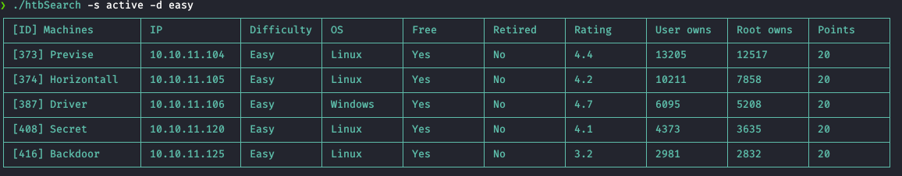

# htbSearch - Smart box search with REGEX
Una simple pero poderosa herramienta para buscar cajas de HTB(y mucho mas), y hacerte la vida mas amena en los CTFs.


## Instalacion

```
sudo apt install make gcc libc6-dev perl-doc -y
sudo cpan Mojo Cpanel::JSON:XS Getopt::Long Text::SimpleTable
cd
git clone https://github.com/sponge369/htbSearch
cd htbSearch/
perl -i.bak -wplE's/my \$TOKEN = "";/my \$TOKEN = "ADD-HERE-TOKEN";/g' htbSearch     #add TOKEN: API KEY Classic HacktheBox
sudo cp htbSearch /usr/local/bin/

```

## Glosario
- -n, --name name_machine <br>
	 nombre de la maquina

- -I | -i, --IP IP<br>
	Direccion IP de la maquina

- -s    retired o active<br>
	Estado de las maquinas( solo existen 2 valores: `retired o active`)

- -f | --flag name_machine FLAG<br>
	Enviar la flag del reto CTF

- -r | --reset name_machine<br>
	Restablecer una maquina

- -d | --difficulty easy, medium, hard o insane<br>
	Dificultad de la maquina

- -os Sistema Operativo<br>
	linux,windows,bsd, ...

- --spawn name_machine<br>
	Machine deploy (VIP)

- --stop name_machine<br>
	Machine stop (VIP)

- --extend name_machine<br>
	Machine extend time (VIP)
	
- --owned name_machine, finish or unfinish<br> 

## Entrada de datos

- Regex(y sus Metacaracteres)
- Case Insensitive


## Uso con ejemplos

### -n, --name: 
- Buscara cualquier maquina que tenga en su nombre 'back'

`htbSearch -n back`
<p align="center">

</p>

<br>

- Buscara maquinas cuyos nombres tengan 'back', 'pre' o 'lam'

`htbSearch -n 'back|pre|lam'`
 
<p align="center">

</p>

<br>

- Buscara maquinas cuyos nombres tengan cualquier caracter([a-zA-Z0-9]) y terminen en 'se'

`htbSearch -n '\w+se$'`
<p align="center">

</p>
el comando anterior se podria simplificar asi:

`htbSearch -n 'se$'`


<br>
<br>


- Buscara todas las maquinas de HacktheBox

`htbSearch -n '\w+'`

<br>


### -I | -i,  --IP
- Buscara la maquina dado una IP

`htbSearch -i 10.10.11.135`
<br>


- Buscara cualquier maquina cuyo ultimo octeto sea '13'

`htbSearch -i '\.13$'`

<p align="center">

</p>

<br>

- Buscara cualquier maquina cuyo ultimo octeto tenga un '13' al final

`htbSearch -i '13$'`

<p align="center">

</p>


<br>


- Buscar cualquier maquina cuyo ultimos octetos sean un '13' o '16'

`htbSearch -i '\.13$|\.16$'`

<p align="center">

</p>

<br>

<br>


### Opciones multiples

- Buscara todas las maquinas con un status de 'active'

`htbSearch -s active`
(Puede probar con activ,act,ac y coincidira con 'active')

<br>


- Buscara todas las maquinas con un status de 'retired'

`htbSearch -s retired`
(retir,ret,re, etc, coincidira con 'retired')

<br>


- Buscara todas las maquinas con dificultad easy activas

`htbSearch -s active -d easy`
<p align="center">

</p>

<br>

- Buscara maquinas retiradas con un sistema operativo Linux

`htbSearch -s retired -os lin`

<br>


- Buscara maquinas retired, easy o medium con sistema operativo bsd o android.
 
`htbSearch -s retired -d 'easy|medium' -os 'bsd|android'`

<p align="center">

</p>
